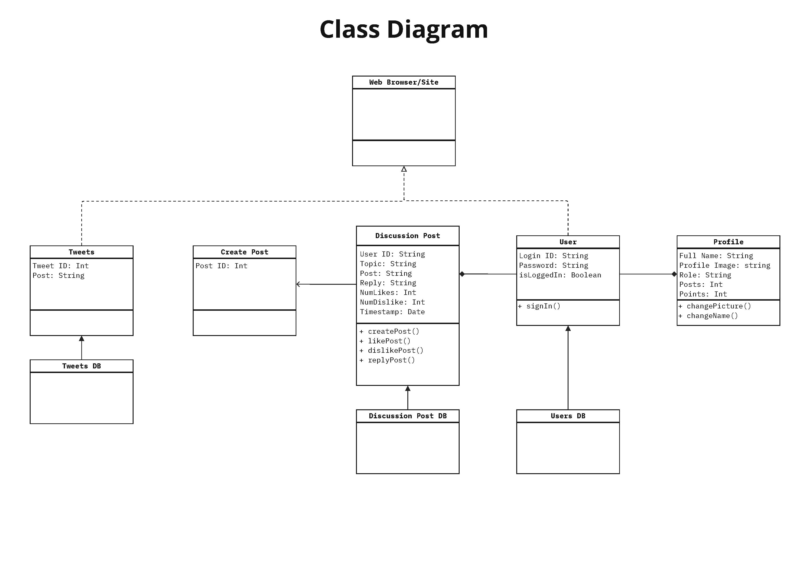
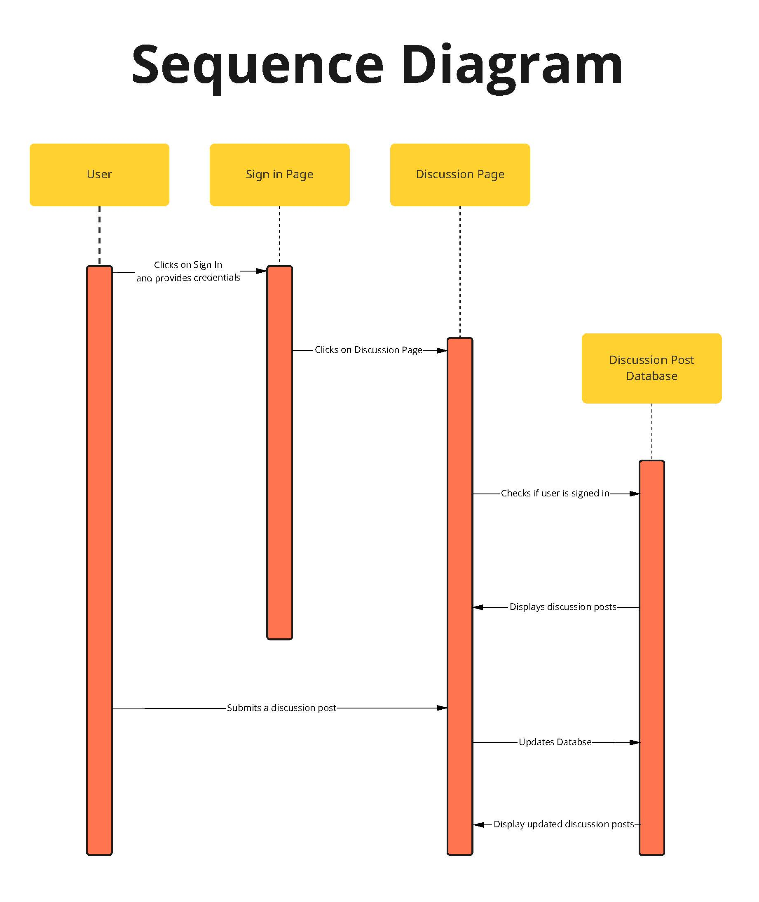
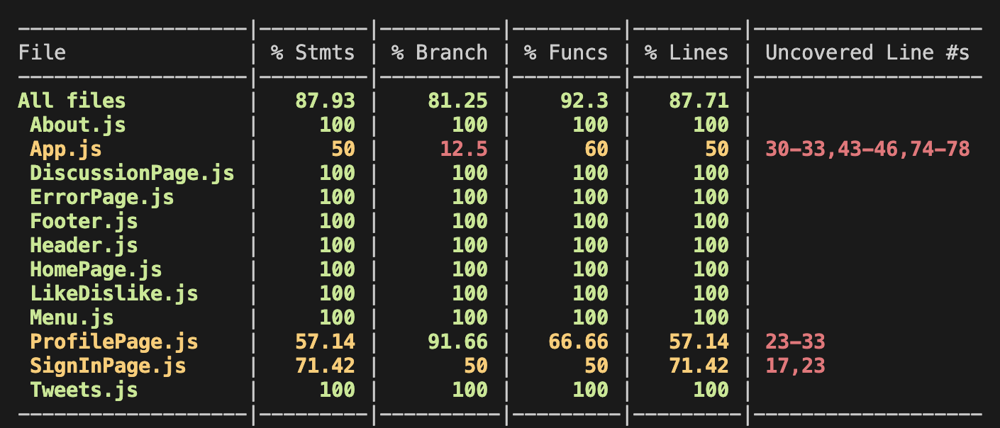
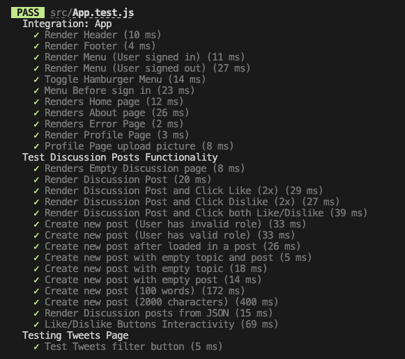

# INFO 443 AU23: Project 1 Final Report
## Report Conducted By: Joseph Tran

### Codebase: ChatGPT: A Brief Rendition
*Application Developed By: Harold Pham, Vivian Hung, Joseph Tran, Muyang Zhou*

#### About our Project

Hello! This repository contains code for the interactive web app we built for INFO 340: *(Client-Side Web Development)* at the University of Washington Information School in Winter 2023. This is a React app built with the intention of introducing ChatGPT and the emergence of other Large Language Models (LLM). Its main functionality consists of pages explaining the importance, a page for discussion of ChatGPT, and another page consisting of popular Tweets regarding ChatGPT.

Our site can be found [here](https://chatgpt-a-brief-rendition.web.app/home).

## Introduction

This report will be an architectural assessment of the application: *ChatGPT: A Brief Rendition*, a website dedicated to informing and connecting people about the recently developed Artificial Intelligence Large Language Models (LLM) ChatGPT. This system is based on React, a simple JavaScript library created by Meta to create user interfaces. Along with it, there are numerous JavaScript modules that make up this application. In the following sections, I will identify strengths and weaknesses within the overall architecture as well as go into detail about the main component of the application: `DiscussionPage`.

## Code Structure Analysis
#### What are the code-level architectural elements of the system?

The application consists of 12 primary components and 2 main modules. Below is a brief description of each and their relationships to one another. There is also a diagram showing how the primary components connect with one another.

| Component/Elements | Description |
| :----------------: | :---------- | 
|React| This JavaScript module is the foundation for the application and is what it is built on. |
| Firebase | This JavaScript module handles data storage as well as user authentication. |
| About | This component shows a more in-depth description of what ChatGPT is, who it affects, and why we should care. |
| App | The main component of the application at the top of the chain which controls all the other components. |
| DiscussionPage | A primary component of the application that allows stakeholders to engage in discussions with one another regarding ChatGPT. It utilizes Firebase’s database to store all the posts.|
| ErrorPage | A secondary component that displays an error page when a stakeholder visits an invalid link. |
| Footer | This component is at the bottom of every page and shows the site’s contact information as well as the copyright of the developers. |
| Header | This component is at the top of the page below the menu bar. Its primary job is to show the header “ChatGPT: A Brief Rendition” and its subtitle “What does it mean for everyone?” |
| HomePage | This component is the home page of the website. The App component will display this component first when a stakeholder navigates to the website. |
| LikeDislike | This is a subcomponent of the `DiscussionPage` component. Its primary job is to be the like and dislike buttons of each discussion post. | 
| Menu | This component is in charge of navigation. It allows the stakeholder to click on a page and will redirect them to the correct components. |
| ProfilePage | This component’s job is to show a user their profile, which consists of their name, profile picture, and their discussion post statistics. This data is stored in Firebase’s database. |
| SignInPage | This component handles user authentication with the help of Firebase authentication. |
| Tweets | This component shows relevant Tweets from many Artificial Intelligence researchers. |

*Table 1: Application components, elements, and descriptions*

*Image 1: Class Diagram*

Although many of these components from *Table 1* are independent, many must be used in conjunction. The 'App' component, which is built to use the React and Firebase modules, is the main component because it controls all of the other components that make the website work. *Image 1* shows an example of this with the 'DiscussionPage' component. You need to utilize the Users component and Firebase to authenticate the user’s credentials and get their name. In the following section, I will discuss the relationships between `DiscussionPage` and the components that are linked to it, as well as how information flows through it to ensure the component's success.

#### What are the code's process flows?

*Image 2* shows a sequence diagram of the main component 'DiscussionPage' which is called by the App component. To begin, ensure that the user is authenticated via Firebase. After that, the user will then navigate to the Discussion Page. Following the completion of these two steps, the DiscussionPost component will query Firebase for the discussion posts database in order to provide the posts previously created by other users. The user can then create a new post in the respective fields, which will be displayed beneath all previous posts. When the user submits the post, the component updates the Firebase discussion post database. The updated database will then be returned to the `DiscussionPage` component, which will display the newly created post alongside the previous posts.

*Image 2: Sequence Diagram*

## Architecture Assessment

I will be primarily assessing the architecture of the DiscussionPost component.

#### Code Smells
##### Location: `DiscussionPage.js`
1. Long and confusing function - The RenderAllPost function is quite large and might make it difficult to understand and maintain. It might be better to adjust variable names and define a new function with the name renderSinglePost to help improve readability.
1. Mysterious Name - While initializing the database, the code uses mysterious variable names such as `theMessageObj`, `objKeys`, `valueObj`, and `objArray`. This is confusing and it is not clear what the code is doing as it just tells us the data type.
1. Duplicated Code - The handleLikePost and handleDislikePost have similar functionality. The only difference between them is one handle likes while the other handles dislikes.
##### Location: Various Files
4. Comments - Throughout the whole codebase, there are many comments scattered around that either try to explain the code or are just unnecessary.
5. Indentation - In the whole codebase, there is an indentation discrepancy. This is an issue as it is important for readability and consistency.

#### Documentation/Readability Concerns

1. There is a random inline comment present within the RenderAllPost function.
1. Code is not consistently formatted - This affects the readability of the component and may confuse future developers later down the line.

#### Standards Violations

1. In-line CSS and Bootstrap - CSS should generally be all in the `styles.css` file as this allows for easier modification later on if necessary. It eliminates the need to modify each individual element.
1. CSS Choice - The orange background and white text seem like a major accessibility issue to the color-impaired. In the future, different color choices will be made to ensure that everyone is able to enjoy the colors of the website.

#### Design Quality Deficiencies

1. Creating new posts error - While creating new posts, it did not check if the contents were null. This is an issue because we only want to create a new post if there is both a title and content.
1. Efficient data loading - The application is constantly querying the Firebase database for information. This may become an issue if there are a large number of posts with a lot of content, as they may slow down the code.
1. Lack of Error handling - This application does not throw many errors when issues occur. This might lead to problems later on as it could be difficult to debug.

## Automated Testing

If you would like to view what my tests do, the [App.test.js](/src/App.test.js) test file can be found within the src directory. Otherwise, please follow the steps below to execute the tests.

#### Steps to execute tests
1. Open up a terminal window.
1. Navigate to the root directory of the repository.
1. Run the command `npm install` to download all the necessary dependencies.
1. Run the command `npm test -- --coverage`.
   > NOTE: If that does not display/test the individual components of the application, please run `npm test App.test.js -- --coverage --collectCoverageFrom='src/components/*.js'` to execute the tests on all the components located in the src folder. 
1. Click the `q` key or `Control + C` to end the test in the terminal. 

Although I have many tests that span over many components, I am focusing solely on the `DiscussionPage` component. Below is a brief description of each test I conducted and what they do. 

#### Test Discussion Posts Functionality 

| Test | What does it do? |
| :--- | :--------------- | 
| Renders Empty Discussion Page | This tests if the component can be rendered when the App calls it. |
| Renders Discussion Post | This tests if a discussion post can be rendered correctly. |
| Renders Discussion Post and Click Like (2x) | This tests if a discussion post can be rendered correctly and if you can click the like button and see the value update. |
| Renders Discussion Post and Click Dislike (2x) | This tests if a discussion post can be rendered correctly and if you can click the dislike button and see the value update |
| Renders Discussion Post and Click Both Like/Dislike | This tests if a discussion post can be rendered correctly and if you can click both the like and dislike button and see the values update. |
| Create new post (User has invalid role) | This tests if a post is able to be created if the user has an invalid role set. |
| Create new post (User has valid role) | This tests if a post is able to be created if the user has a valid role set. |
| Create new post after loaded in a post | This tests if a new post can be created after loading in a previous post. |
| Create new post with empty topic and post | This tests if you can submit a post with an empty topic and post field. |
| Create new post with empty topic| This tests if you can submit a post with an empty topic field but have filled out the post field. |
| Create new post with empty post | This tests if you can submit a post with an empty post field but have filled out the topic field. |
| Create new post (100 words) | This tests if the database is able to handle writing and reading in a post with 100 words. |
| Create new post (2000 characters) | This is a stress test to see if the database is able to handle writing and reading in a post with large content.  |
| Render Discussion posts from JSON | This test simulates importing discussion posts from the Firebase database. |
| Like/Dislike Button Interactivity | This test simulates simultaneous clicking of the like and dislike buttons to ensure that the values increment/decrement correctly |

*Table 3: DiscussionPage Component Automated Tests*

All of the tests in *Table 3* pass giving me 100% test coverage within the `DiscussionPage` component. Below in *Image 3*, is the current test coverage report of the entire application. In the real world, it is advised to have tests that cover all the components within your application. Although I was very close to achieving a 100% coverage score for all categories, I was unable to finish testing for the `App`, `ProfilePage`, `SignInPage`, and `Tweets` components. Even though my `Tweets` component is showing 100% coverage, I was unable to verify that my component behaves the way it should. I needed to comment out this test along with an authentication test due to it causing my GitHub classroom tester to fail. In the end, I was able to have 27 automated tests that all passed and functioned correctly (see *Image 4* below)!

*Image 3: Code Test Coverage*

*Image 4: All automated tests passing*

## Refactoring Code

1. Code is too large in class - I refactored the RenderAllPost function by creating a separate function that solely renders a single post. The refactoring also included adjustments in variable naming to further improve the readability of the function.
1. Mysterious Name - I renamed the variables `theMessageObj` to `discussionPost`, 
`objKeys` to `postId`, `valueObj` to `postDatabase`, `objArray` to `listOfPosts`. Additionally, I have created a new function `renderSinglePost` to handle rendering each individual post. 
1. Duplicated Code - To fix the redundancy between `handleLikePost` and `handleDislikePost`, I created a new variable named `handleReaction` which still accepts a post as a parameter. Its additional parameter is whether the post has recently received a like or dislike reaction. This will assist `handleReaction` in setting the appropriate state.
1. Comments - I went through all the components checking the comments. I either refactored the code to make it more readable or just erased the unnecessary comment. 
1. Indentation - I went through all the components and updated the indentation for all. I adjusted all of them to have an indentation of four spaces.