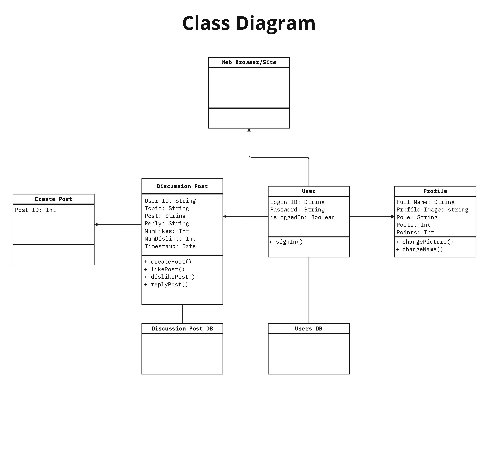
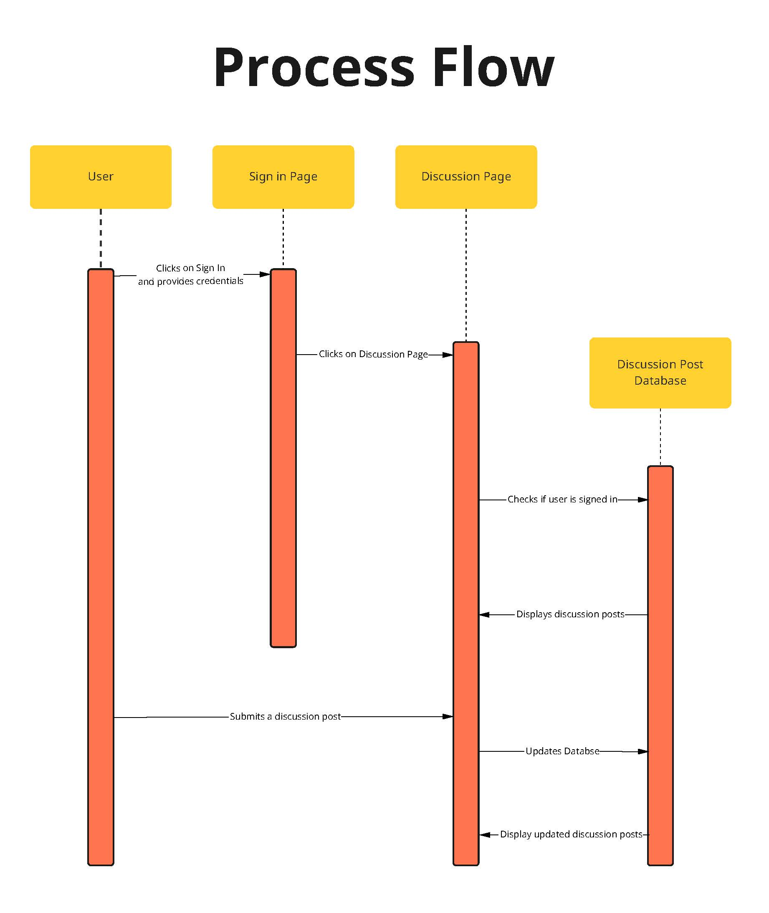

# ChatGPT: A Brief Rendition
## By: Harold Pham, Vivian Hung, Joseph Tran, Muyang Zhou

Hello! This repository contains code for the interactive web app we built for INFO 340: *(Client-Side Web Development)* at the University of Washington Information School in Winter 2023. This is a React app built with the intention of introducing ChatGPT and the emergence of other Large Language Models (LLM).

Our site can be found [here](https://chatgpt-a-brief-rendition.web.app/home).

## Checkpoint 2 Diagrams

**Checkpoint 2: Optional Element**

I would analyze the architectural quality of the discussion posts page write unit tests for that.
